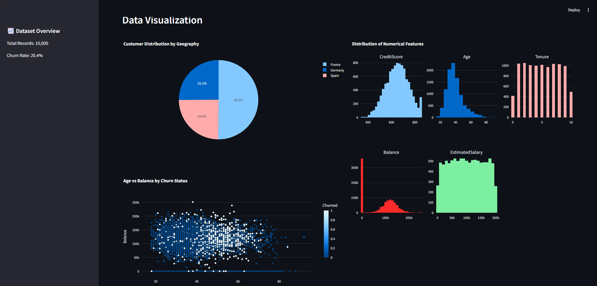

# Customer Churn Analysis Dashboard

A real-time dashboard for predicting and analyzing customer churn patterns using machine learning. Built with Streamlit and scikit-learn, this application helps identify and visualize key factors contributing to customer churn.



## Features

- **Interactive Data Visualization**
  - Geographical customer distribution
  - Age vs Balance relationships
  - Distribution plots for numerical features
  - Correlation heatmaps

- **Machine Learning Model**
  - Random Forest Classifier with 86.6% accuracy
  - Feature importance analysis
  - Real-time model performance metrics
  - Interactive confusion matrix

- **Performance Metrics**
  - Accuracy: 86.6%
  - Precision: 79.2%
  - Recall: 42.7%
  - F1 Score: 55.5%

## Installation

```bash
# Clone the repository
git clone https://github.com/farru049/churn-analysis-dashboard.git

# Navigate to project directory
cd churn-analysis-dashboard

# Install required packages
pip install -r requirements.txt
```

## Usage

```bash
# Run the Streamlit app
streamlit run app.py
```

Visit `http://localhost:8501` in your browser to view the dashboard.

## Requirements

```text
pandas==2.0.0
numpy==1.24.0
scikit-learn==1.2.2
streamlit==1.22.0
plotly==5.14.0
seaborn==0.12.2
matplotlib==3.7.1
```

## Project Structure

```
├── app.py                  # Main Streamlit application
├── Churn_Modelling.csv    # Dataset
├── requirements.txt       # Project dependencies
└── README.md
```

## Dataset

The dataset contains customer information including:
- Demographics (Age, Geography, Gender)
- Banking relationships (Balance, Credit Score, Tenure)
- Product usage (Number of Products, Has Credit Card)
- Target variable (Exited - whether customer churned or not)

## Contributing

1. Fork the repository
2. Create your feature branch (`git checkout -b feature/AmazingFeature`)
3. Commit your changes (`git commit -m 'Add some AmazingFeature'`)
4. Push to the branch (`git push origin feature/AmazingFeature`)
5. Open a Pull Request

## License

This project is licensed under the MIT License - see the [LICENSE](LICENSE) file for details.

## Acknowledgments

- Dataset source: [Add source if applicable]
- Inspired by [Add inspiration if applicable]

Project Link: [https://github.com/yourusername/churn-analysis-dashboard](https://github.com/farru049/churn-analysis-dashboard)

Would you like me to add or modify any section of the README?